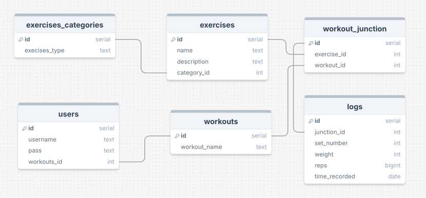

# Workout App Development Guidelines

This document provides essential information for developers working on the Workout App project.

## Build/Configuration Instructions

### Prerequisites
- Node.js (v14 or higher)
- PostgreSQL database

### Database Setup


1. Install PostgreSQL and create a database named `workout_app`

### Project Setup
1. Install dependencies:
   ```bash
   npm install
   ```
2. Start the server:
   ```bash
   npm start
   ```
3. Access the application at `http://localhost:3000`
